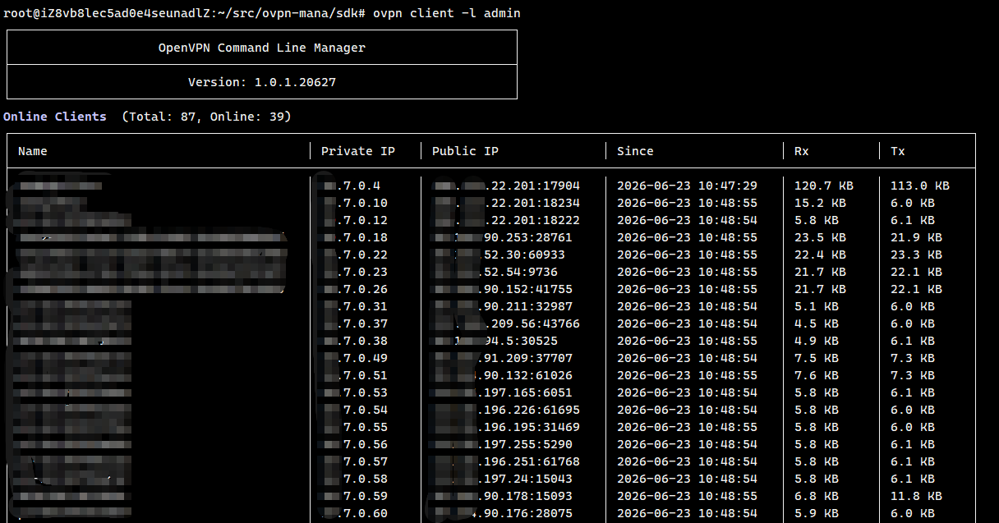

# OVPN-MANA

OpenVPN Manager (OVPN-MANA) — 跨平台 OpenVPN 命令行管理工具与 C++17 动态库。提供 OpenVPN 服务全生命周期管理、Easy-RSA 证书自动签发与吊销、客户端批量配置下发、在线客户端流量监控。支持 Linux / Windows，适用于 IoT 设备管理、企业 VPN 自动化运维、C# / Go 宿主程序集成。

[](https://en.cppreference.com/w/cpp/17)
[](https://github.com/OpenVPN/easy-rsa)
[](https://openvpn.net)
[]()

---

## 目录

- [OVPN-MANA](#ovpn-mana)
  - [目录](#目录)
  - [快速开始](#快速开始)
    - [依赖安装](#依赖安装)
    - [首次初始化（Linux）](#首次初始化linux)
    - [基本使用](#基本使用)
  - [环境检测](#环境检测)
  - [CLI 命令参考](#cli-命令参考)
    - [服务管理](#服务管理)
    - [客户端管理](#客户端管理)
  - [项目结构](#项目结构)
  - [C API 参考](#c-api-参考)
    - [生命周期](#生命周期)
    - [服务管理](#服务管理-1)
    - [客户端管理](#客户端管理-1)
    - [数据结构](#数据结构)
    - [错误码](#错误码)
  - [编译构建](#编译构建)
    - [Linux](#linux)
    - [Windows](#windows)
  - [部署与运维](#部署与运维)
    - [标准部署流程](#标准部署流程)
    - [运行时架构](#运行时架构)
    - [CA 密码保护](#ca-密码保护)
    - [宿主程序集成](#宿主程序集成)
  - [生产环境迁移](#生产环境迁移)
    - [不兼容变更](#不兼容变更)
    - [迁移步骤](#迁移步骤)
  - [客户端固定 IP](#客户端固定-ip)
    - [通过 CLI 指定](#通过-cli-指定)
    - [通过 C API 指定](#通过-c-api-指定)
    - [实现机制](#实现机制)
  - [测试](#测试)
  - [宿主程序权限集成](#宿主程序权限集成)
    - [方案对比](#方案对比)
    - [方案一：sudoers 白名单（推荐）](#方案一sudoers-白名单推荐)
    - [方案二：setuid 包装器](#方案二setuid-包装器)
    - [方案三：systemd 服务](#方案三systemd-服务)
    - [方案四：Linux Capabilities](#方案四linux-capabilities)
    - [部署检查清单](#部署检查清单)
  - [常见问题](#常见问题)
    - [服务创建失败](#服务创建失败)
    - [服务启动失败](#服务启动失败)
    - [首次创建服务耗时很长](#首次创建服务耗时很长)
    - [吊销客户端后服务自动重启](#吊销客户端后服务自动重启)
    - [生产环境迁移后找不到 CA](#生产环境迁移后找不到-ca)
    - [客户端创建报 `Invalid WAN IP`](#客户端创建报-invalid-wan-ip)
    - [客户端列表表格错乱](#客户端列表表格错乱)
    - [宿主程序集成后崩溃](#宿主程序集成后崩溃)
    - [动态库调用无反应](#动态库调用无反应)
  - [注意事项](#注意事项)

---

## 快速开始



### 依赖安装

**Linux (Debian/Ubuntu)**

```bash
sudo apt update
sudo apt install openvpn easy-rsa
```

**Windows**

下载并安装 [OpenVPN](https://openvpn.net/community-downloads/) 和 [Easy-RSA](https://github.com/OpenVPN/easy-rsa/releases)。

### 首次初始化（Linux）

CA 密钥对是 Easy-RSA 签发的根证书，**仅需执行一次**：

```bash
sudo mkdir -p /etc/openvpn/easy-rsa
cd /etc/openvpn/easy-rsa
sudo easyrsa init-pki
sudo easyrsa build-ca nopass
sudo easyrsa gen-dh
```

> `nopass` 跳过 CA 私钥密码交互，适合自动化部署。生产环境如需密码保护，见下方 [CA 密码保护](#ca-密码保护)。

### 基本使用

```bash
# 环境检测
sudo openvpnmgr --check

# 创建服务
sudo openvpnmgr service -c mysvc,1194,10.8.0.0/24

# 创建客户端
sudo openvpnmgr client -c mysvc,alice,1.2.3.4

# 查看在线客户端
sudo openvpnmgr client -l mysvc
```

---

## 环境检测

`--check` 参数自动检测当前系统 OpenVPN 运行环境，兼容 Linux / Windows。

```bash
sudo openvpnmgr --check
```

输出示例：

```
Platform: Linux

  [OK] OpenVPN Binary          (/usr/sbin/openvpn)
  [OK] Easy-RSA                 (easyrsa in PATH)
  [OK] OpenVPN systemd Active   (active)
  [OK] TUN Device               (/dev/net/tun)
  [OK] ip route tool            (/usr/sbin/ip)

5/5 checks passed  All checks OK
```

---

## CLI 命令参考

### 服务管理

| 命令                                  | 说明                                       |
| ------------------------------------- | ------------------------------------------ |
| `service -l`                        | 列出所有服务                               |
| `service -c <name>,<port>,<subnet>` | 创建服务（例：`mysvc,1194,10.8.0.0/24`） |
| `service -d <name>`                 | 删除服务（含证书吊销）                     |
| `service -start <name>`             | 启动服务                                   |
| `service -stop <name>`              | 停止服务                                   |
| `service -restart <name>`           | 重启服务                                   |

### 客户端管理

| 命令                                                     | 说明                                           |
| -------------------------------------------------------- | ---------------------------------------------- |
| `client -l <service_name>`                             | 列出在线客户端（按 IP 升序，含流量统计）       |
| `client -c <service_name>,<name>,<host>[,<client_ip>]` | 创建客户端（host 支持 IP 或域名，可选固定 IP） |
| `client -d <service_name>,<name>`                      | 吊销客户端证书                                 |
| `client -conf <service_name>,<name>`                   | 获取客户端 `.ovpn` 配置文件                  |

---

## 项目结构

```
.
├── cmake/
│   ├── config.hpp.in                  # 构建配置模板
│   └── version.hpp.in                 # 版本号模板
├── include/
│   ├── ovpn-mana/
│   │   ├── ovpn_mana_api.h            # 公共 C API 声明
│   │   ├── ovpn_mana_platform.h       # 平台兼容宏（Linux/Windows）
│   │   ├── ovpn_mana_types.h          # 公共类型定义（ovpn_service_t、ovpn_client_t、错误码）
│   │   └── ovpn_mana_version.h        # 版本号（cmake 生成）
│   └── config.hpp                     # 运行环境配置（cmake 生成）
├── src/
│   ├── cli/
│   │   ├── cli_handler.cpp            # CLI 命令解析与分发
│   │   ├── cli_handler.hpp
│   │   ├── console_renderer.cpp       # 终端表格渲染（服务列表、客户端列表、字节可读化）
│   │   └── console_renderer.hpp
│   ├── core/
│   │   ├── app_config.hpp             # 应用配置结构体
│   │   ├── command_templates.cpp      # 命令模板替换（Easy-RSA / systemctl）
│   │   ├── command_templates.hpp
│   │   ├── openvpn_manager.cpp        # 核心业务逻辑（服务/客户端管理、证书生成、命令执行）
│   │   ├── openvpn_manager.hpp
│   │   ├── validators.cpp             # 参数校验（IP、端口、子网 CIDR、名称合法性）
│   │   └── validators.hpp
│   ├── main.cpp                       # CLI 入口
│   └── ovpn_mana_api.cpp              # C API 桥接层
├── test/
│   ├── test_appconfig_defaults.cpp    # AppConfig 默认值兼容性测试
│   ├── test_cli_e2e.sh                # CLI 端到端测试脚本
│   ├── test_command_templates.cpp     # 命令模板替换单元测试
│   ├── test_validators.cpp            # 参数校验单元测试
│   └── test_validators_integration.cpp # 参数校验集成测试
├── docs/                              # 开发文档
├── CMakeLists.txt
└── README.md
```

---

## C API 参考

### 生命周期

```c
ovpn_mana_handle_t ovpn_mana_create();
void ovpn_mana_destroy(ovpn_mana_handle_t handle);
```

### 服务管理

```c
ovpn_err_t ovpn_mana_list_services(ovpn_mana_handle_t handle, ovpn_service_t *services, int &service_count);
ovpn_err_t ovpn_mana_create_service(ovpn_mana_handle_t handle, const char *name, const char *subnet, int port);
ovpn_err_t ovpn_mana_start_service(ovpn_mana_handle_t handle, const char *name);
ovpn_err_t ovpn_mana_stop_service(ovpn_mana_handle_t handle, const char *name);
ovpn_err_t ovpn_mana_restart_service(ovpn_mana_handle_t handle, const char *name);
ovpn_err_t ovpn_mana_delete_service(ovpn_mana_handle_t handle, const char *name);
```

### 客户端管理

```c
ovpn_err_t ovpn_mana_create_client(ovpn_mana_handle_t handle, const char *service_name, const char *name, const char *wanip);
ovpn_err_t ovpn_mana_create_client_with_ip(ovpn_mana_handle_t handle, const char *service_name, const char *name, const char *wanip, const char *client_ip);
ovpn_err_t ovpn_mana_revoke_client(ovpn_mana_handle_t handle, const char *service_name, const char *name);
ovpn_err_t ovpn_mana_get_online_clients(ovpn_mana_handle_t handle, const char *service_name, ovpn_client_t *clients, int &client_count);
ovpn_err_t ovpn_mana_get_total_clients_count(ovpn_mana_handle_t handle, const char *service_name, int &total_count);
ovpn_err_t ovpn_mana_get_client_config(ovpn_mana_handle_t handle, const char *service_name, const char *name, char *ovpn_file, int &ovpn_file_size);
```

### 数据结构

**`ovpn_service_t`**

| 字段             | 类型          | 说明            |
| ---------------- | ------------- | --------------- |
| `name`         | `char[64]`  | 服务名称        |
| `configPath`   | `char[256]` | 配置文件路径    |
| `port`         | `int`       | 监听端口        |
| `subnet`       | `char[32]`  | 客户端子网 CIDR |
| `is_activated` | `int`       | 是否运行中      |
| `is_enabled`   | `int`       | 是否开机自启    |

**`ovpn_client_t`**

| 字段               | 类型                   | 说明         |
| ------------------ | ---------------------- | ------------ |
| `name`           | `char[128]`          | 客户端名称   |
| `private_ipv4`   | `char[32]`           | VPN 内网 IP  |
| `public_ipv4`    | `char[64]`           | 公网 IP:Port |
| `since`          | `char[64]`           | 连接时间     |
| `bytes_received` | `unsigned long long` | 接收字节数   |
| `bytes_sent`     | `unsigned long long` | 发送字节数   |

### 错误码

| 常量                           | 值     | 说明        |
| ------------------------------ | ------ | ----------- |
| `OVPN_ERR_SUCCESS`           | `0`  | 成功        |
| `OVPN_ERR_FAILURE`           | `-1` | 通用失败    |
| `OVPN_ERR_INVALID_PARAM`     | `-2` | 参数不合法  |
| `OVPN_ERR_NOT_FOUND`         | `-3` | 资源不存在  |
| `OVPN_ERR_PERMISSION_DENIED` | `-4` | 权限不足    |
| `OVPN_ERR_TIMEOUT`           | `-5` | 操作超时    |
| `OVPN_ERR_IO_FAILURE`        | `-6` | IO 操作失败 |

---

## 编译构建

### Linux

```bash
mkdir build && cd build
cmake .. -DCMAKE_BUILD_TYPE=Release
cmake --build .
```

产物位于 `build/Linux_<arch>/`：

| 文件                | 说明               |
| ------------------- | ------------------ |
| `openvpnmgr`      | CLI 可执行文件     |
| `libovpn-mana.so` | 动态库             |
| `test_*`          | 单元测试可执行文件 |

### Windows

```bash
mkdir build && cd build
cmake .. -DCMAKE_TOOLCHAIN_FILE=<vcpkg_root>/scripts/buildsystems/vcpkg.cmake
cmake --build . --config Release
```

产物位于 `build/Windows_AMD64/Release/`。

---

## 部署与运维

### 标准部署流程

```bash
# 1. 安装依赖
sudo apt install openvpn easy-rsa

# 2. 初始化 PKI（仅首次）
sudo mkdir -p /etc/openvpn/easy-rsa
cd /etc/openvpn/easy-rsa
sudo easyrsa init-pki
sudo easyrsa build-ca nopass
sudo easyrsa gen-dh

# 3. 环境检测
sudo openvpnmgr --check

# 4. 创建服务
sudo openvpnmgr service -c prod,1194,10.8.0.0/24
```

### 运行时架构

```
┌──────────────┐     ┌──────────────────┐     ┌─────────────────┐
│  宿主程序     │────▶│  libovpn-mana.so │────▶│  Easy-RSA CLI    │
│  (C/C++/Go)  │     │  (C API)         │     │  (证书签发/吊销)  │
└──────────────┘     └──────────────────┘     └─────────────────┘
                              │                         │
                              ▼                         ▼
                     ┌──────────────────┐     ┌─────────────────┐
                     │  systemctl       │     │  openvpn         │
                     │  (服务启停)       │     │  (VPN 进程)      │
                     └──────────────────┘     └─────────────────┘
```

### CA 密码保护

生产环境应对 CA 私钥设置密码，防止证书签发权限被滥用。Easy-RSA 3.x 原生支持通过环境变量传递密码，**无需 expect 脚本**。

**初始化带密码的 CA**

```bash
cd /etc/openvpn/easy-rsa
sudo easyrsa init-pki

# 通过环境变量设置密码
export EASYRSA_PASSIN="pass:yourSecretPassphrase"
export EASYRSA_PASSOUT="pass:yourSecretPassphrase"
sudo -E easyrsa build-ca
```

**日常签发证书**

```bash
# 每次 sign-req 都需要设置密码环境变量
export EASYRSA_PASSIN="pass:yourSecretPassphrase"
sudo -E easyrsa sign-req server my-server
sudo -E easyrsa sign-req client my-client
```

**从文件读取密码（推荐）**

```bash
# 创建仅 root 可读的密码文件
sudo bash -c 'echo "yourSecretPassphrase" > /etc/openvpn/easy-rsa/.capass'
sudo chmod 600 /etc/openvpn/easy-rsa/.capass

# 使用 file: 前缀读取
export EASYRSA_PASSIN="file:/etc/openvpn/easy-rsa/.capass"
export EASYRSA_PASSOUT="file:/etc/openvpn/easy-rsa/.capass"
sudo -E easyrsa build-ca
```

**从密钥管理服务读取**

```bash
export EASYRSA_PASSIN="pass:$(vault read -field=passphrase secret/ovpn-ca)"
export EASYRSA_PASSOUT="pass:$(vault read -field=passphrase secret/ovpn-ca)"
```

**启动时自动生效**

```bash
# /etc/profile.d/ovpn-ca.sh（仅 root 可读）
if [ "$(id -u)" -eq 0 ]; then
    export EASYRSA_PASSIN="file:/etc/openvpn/easy-rsa/.capass"
    export EASYRSA_PASSOUT="file:/etc/openvpn/easy-rsa/.capass"
fi
```

> `-E` 参数确保 sudo 保留当前环境变量。`pass:` 表示明文密码，`file:` 表示从文件读取。
> 如果宿主程序通过 `popen` 调用 easyrsa，需在命令前设置环境变量：
> `export EASYRSA_PASSIN="file:/etc/openvpn/easy-rsa/.capass" && cd /etc/openvpn/easy-rsa && easyrsa sign-req ...`

### 宿主程序集成

```c
#include "ovpn-mana.hpp"

int main() {
    ovpn_mana_handle_t h = ovpn_mana_create();

    ovpn_err_t err = ovpn_mana_create_service(h, "myvpn", "10.8.0.0/24", 1194);
    if (err == OVPN_ERR_SUCCESS) {
        ovpn_mana_start_service(h, "myvpn");
    }

    ovpn_mana_destroy(h);
    return 0;
}
```

编译：`g++ -std=c++17 myapp.cpp -lovpn-mana -L./build/Linux_aarch64`

---

## 生产环境迁移

如果从旧版本（1.0.0.1）升级至当前版本（1.0.0.20626），需注意以下变更。

### 不兼容变更

| 变更                                                              | 影响                   | 迁移方案                   |
| ----------------------------------------------------------------- | ---------------------- | -------------------------- |
| PKI 路径从 `/home/xuwh/easy-rsa` 改为 `/etc/openvpn/easy-rsa` | 证书操作全部失败       | 创建符号链接               |
| easyrsa 从安装目录改为 PATH 调用                                  | 找不到 easyrsa 命令    | 链接到 `/usr/local/bin`  |
| `ovpn_service_t` 新增 `port`/`subnet` 字段                  | 旧宿主程序 ABI 不兼容  | 重新编译宿主程序           |
| 文件权限 `644` → `600`                                       | 新创建服务私钥权限更严 | 仅影响新服务               |
| 退出码校验                                                        | 旧版本可能"假成功"     | 更安全，命令失败会正确报错 |

### 迁移步骤

```bash
# 1. 符号链接 PKI（零数据搬迁，已有客户端证书不受影响）
ln -s /root/easy-rsa /etc/openvpn/easy-rsa
ln -s /root/easy-rsa/easyrsa /usr/local/bin/easyrsa

# 2. 验证
ls /etc/openvpn/easy-rsa/pki/ca.crt
easyrsa --version

# 3. 重新编译宿主程序（如果使用 C API 动态库）
# 使用新版本 include/ovpn-mana.hpp 和 include/sdk.types.hpp

# 4. 替换 CLI 二进制
cp openvpnmgr /usr/local/bin/
```

> 已有服务不受影响，OpenVPN 进程不依赖本工具。仅**新增/吊销证书**时需要 PKI 路径正确。

---

## 客户端固定 IP

### 通过 CLI 指定

```bash
# 固定 IP（第 4 个参数可选）
sudo openvpnmgr client -c mysvc,alice,1.2.3.4,10.8.0.100

# 省略第 4 个参数则由 OpenVPN 动态分配
sudo openvpnmgr client -c mysvc,bob,1.2.3.5
```

### 通过 C API 指定

```c
// 固定 IP
ovpn_mana_create_client_with_ip(handle, "mysvc", "alice", "1.2.3.4", "10.8.0.100");

// 动态分配
ovpn_mana_create_client(handle, "mysvc", "bob", "1.2.3.5");
```

### 实现机制

固定 IP 通过 OpenVPN 的 **CCD（client-config-dir）** 实现：

1. 在 `ccd/<client_name>` 文件中写入 `ifconfig-push 10.8.0.100 255.255.255.0`
2. 创建时自动检测 IP 冲突，防止同一 IP 分配给多个客户端
3. 服务端配置模板已包含 `client-config-dir ccd` 指令

> 每个客户端占用一个 CCD 文件，吊销客户端时 CCD 文件会一并清理。

---

## 测试

```bash
cd build
cmake --build . --config Release

# 运行所有测试
ctest --output-on-failure

# 或逐个运行
./test_validators
./test_command_templates
./test_validators_integration
./test_appconfig_defaults
```

测试覆盖：

| 测试套件                        | 用例数 | 覆盖范围                                |
| ------------------------------- | ------ | --------------------------------------- |
| `test_validators`             | 16     | 参数校验：IP、端口、子网 CIDR、边界条件 |
| `test_command_templates`      | 8      | 命令模板替换：占位符替换、路径拼接      |
| `test_validators_integration` | 10     | 集成校验：组合参数、服务名规范          |
| `test_appconfig_defaults`     | 8      | 配置默认值兼容性：路径、二进制位置      |
| `test_cli_e2e.sh`             | 15     | CLI 端到端：服务/客户端全生命周期       |

---

## 宿主程序权限集成

`libovpn-mana.so` 内部通过 `popen` 调用 `systemctl`、`easyrsa`、`openvpn` 等系统命令，这些命令需要 **root 权限**。当宿主程序以普通用户身份运行时（如 C# + ABP 部署在 `www-data` 或专用服务账户下），必须解决权限提升问题。

以下方案按 **安全性从高到低** 排列。

### 方案对比

| 方案                                         | 安全性     | 复杂度 | 适用场景                  |
| -------------------------------------------- | ---------- | ------ | ------------------------- |
| [sudoers 白名单](#方案一sudoers-白名单推荐)     | ★★★★   | 低     | 通用场景，推荐            |
| [setuid 包装器](#方案二setuid-包装器)           | ★★★     | 中     | 无 sudo 环境              |
| [systemd 服务](#方案三systemd-服务)             | ★★★★★ | 中     | 宿主本身也是 systemd 服务 |
| [Linux Capabilities](#方案四linux-capabilities) | ★★★★★ | 高     | 容器化 / 安全敏感环境     |

### 方案一：sudoers 白名单（推荐）

仅授权宿主程序以无密码方式执行特定命令，遵循最小权限原则。

```bash
# /etc/sudoers.d/ovpn-mana
# 允许 ovpn-mana 服务账户无密码执行必要命令
ovpn-svc ALL=(root) NOPASSWD: /usr/sbin/openvpn
ovpn-svc ALL=(root) NOPASSWD: /bin/systemctl start openvpn@*
ovpn-svc ALL=(root) NOPASSWD: /bin/systemctl stop openvpn@*
ovpn-svc ALL=(root) NOPASSWD: /bin/systemctl restart openvpn@*
ovpn-svc ALL=(root) NOPASSWD: /bin/systemctl enable openvpn@*
ovpn-svc ALL=(root) NOPASSWD: /bin/systemctl disable openvpn@*
ovpn-svc ALL=(root) NOPASSWD: /bin/systemctl is-active openvpn@*
ovpn-svc ALL=(root) NOPASSWD: /bin/systemctl is-enabled openvpn@*
ovpn-svc ALL=(root) NOPASSWD: /usr/local/bin/easyrsa *
ovpn-svc ALL=(root) NOPASSWD: /bin/cp /etc/openvpn/easy-rsa/pki/* /etc/openvpn/server/*
ovpn-svc ALL=(root) NOPASSWD: /bin/chmod 600 /etc/openvpn/server/*/*
ovpn-svc ALL=(root) NOPASSWD: /bin/chmod 644 /etc/openvpn/server/*/*.crt
ovpn-svc ALL=(root) NOPASSWD: /bin/chmod 644 /etc/openvpn/server/*/*.pem
ovpn-svc ALL=(root) NOPASSWD: /bin/mkdir -p /etc/openvpn/server/*
ovpn-svc ALL=(root) NOPASSWD: /bin/rm -rf /etc/openvpn/server/*
ovpn-svc ALL=(root) NOPASSWD: /bin/cp /etc/openvpn/easy-rsa/pki/issued/* /etc/openvpn/client-config/*
ovpn-svc ALL=(root) NOPASSWD: /usr/bin/tee /etc/openvpn/client-config/*

# 安全加固
Defaults:ovpn-svc !requiretty
Defaults:ovpn-svc env_keep="EASYRSA_PKI EASYRSA_BATCH"
```

C# 侧无需任何改动，`libovpn-mana.so` 内部已通过 `sudo` 前缀调用命令（`/bin/systemctl` → `sudo /bin/systemctl`）。如果动态库未带 `sudo` 前缀，宿主程序需在调用前包装：

```csharp
// ABP Application Service 示例
public class VpnService : IVpnService
{
    // 方案 A：动态库已带 sudo（无需额外处理）
    [DllImport("libovpn-mana.so")]
    private static extern int ovpn_mana_create_service(IntPtr handle,
        string name, string subnet, int port);

    // 方案 B：动态库不带 sudo，宿主程序 fork 后 setuid
    // 不推荐，建议直接用方案一的 sudoers 白名单
}
```

### 方案二：setuid 包装器

编写一个最小化的 C 包装器，以 root 身份执行 CLI 命令。

```c
// ovpn-wrapper.c —— 编译为 setuid 二进制
#include <unistd.h>
#include <stdlib.h>
#include <string.h>

int main(int argc, char *argv[]) {
    if (argc < 2) return 1;

    // 白名单校验，防止任意命令执行
    const char *cmd = argv[1];
    if (strcmp(cmd, "service-list") == 0) {
        execl("/usr/local/bin/openvpnmgr", "openvpnmgr",
              "service", "-l", NULL);
    } else if (strcmp(cmd, "service-create") == 0 && argc == 5) {
        char arg[256];
        snprintf(arg, sizeof(arg), "%s,%s,%s", argv[2], argv[3], argv[4]);
        execl("/usr/local/bin/openvpnmgr", "openvpnmgr",
              "service", "-c", arg, NULL);
    }
    // ... 其他命令白名单

    return 1;
}
```

```bash
# 编译并设置 setuid
gcc -o ovpn-wrapper ovpn-wrapper.c
sudo chown root:ovpn-svc ovpn-wrapper
sudo chmod 4750 ovpn-wrapper        # setuid + 仅 ovpn-svc 组可执行
```

C# 侧通过 `Process.Start` 调用：

```csharp
public async Task CreateServiceAsync(string name, string subnet, int port)
{
    var psi = new ProcessStartInfo
    {
        FileName = "/usr/local/bin/ovpn-wrapper",
        Arguments = $"service-create {name} {subnet} {port}",
        RedirectStandardOutput = true,
        RedirectStandardError = true
    };
    using var proc = Process.Start(psi);
    await proc.WaitForExitAsync();
}
```

### 方案三：systemd 服务

将宿主程序作为 systemd 服务运行，利用 `User=` 和 `CapabilityBoundingSet=` 精确控制权限。

```ini
# /etc/systemd/system/ovpn-mana-host.service
[Unit]
Description=OpenVPN Manager Host Service (ABP)
After=network.target

[Service]
Type=notify
User=ovpn-svc
Group=ovpn-svc

# 仅授予所需能力，而非完整 root
CapabilityBoundingSet=CAP_NET_ADMIN CAP_SYS_ADMIN CAP_DAC_OVERRIDE CAP_CHOWN CAP_FOWNER
AmbientCapabilities=CAP_NET_ADMIN CAP_SYS_ADMIN CAP_DAC_OVERRIDE CAP_CHOWN CAP_FOWNER

# 关键：允许写入 /etc/openvpn
ReadWritePaths=/etc/openvpn
ReadWritePaths=/etc/openvpn/easy-rsa

# 安全加固
NoNewPrivileges=yes
ProtectSystem=strict
ProtectHome=yes
PrivateTmp=yes

WorkingDirectory=/opt/ovpn-mana-host
ExecStart=/opt/ovpn-mana-host/OvpnManaHost
Restart=always
RestartSec=5

[Install]
WantedBy=multi-user.target
```

### 方案四：Linux Capabilities

不授予完整 root，仅给 `openvpnmgr` 二进制必要的能力。

```bash
# 给 CLI 二进制授予最小能力集
sudo setcap cap_net_admin,cap_sys_admin,cap_dac_override,cap_chown,cap_fowner+ep /usr/local/bin/openvpnmgr

# 验证
getcap /usr/local/bin/openvpnmgr
```

此方案对 `systemctl` 类命令无效（systemd 需要完整 root），适用于仅调用 `openvpn` 和 `easyrsa` 的场景。

### 部署检查清单

```bash
# 1. 创建专用服务账户
sudo useradd -r -s /sbin/nologin -d /opt/ovpn-mana-host ovpn-svc

# 2. 授权目录访问
sudo chown -R ovpn-svc:ovpn-svc /etc/openvpn
sudo chmod 750 /etc/openvpn /etc/openvpn/easy-rsa

# 3. 验证权限
sudo -u ovpn-svc /usr/local/bin/openvpnmgr --check

# 4. 如使用 sudoers 方案，验证免密
sudo -u ovpn-svc sudo -n /bin/systemctl is-active openvpn@test-server
```

---

## 常见问题

### 服务创建失败

**`CA not found. Please initialize PKI first`**

PKI 未初始化。执行一次：

```bash
cd /etc/openvpn/easy-rsa && sudo easyrsa init-pki && sudo easyrsa build-ca nopass
```

**`EASYRSA_PKI does not exist`**

当前工作目录不是 `/etc/openvpn/easy-rsa`。easyrsa 命令必须以该目录为工作目录执行：

```bash
cd /etc/openvpn/easy-rsa && easyrsa <command>
```

**`easyrsa_openssl - Command has failed` (sign-req 阶段)**

CA 不存在或 CA 密码错误。检查：

```bash
ls /etc/openvpn/easy-rsa/pki/ca.crt   # CA 证书是否存在
```

如果使用了密码保护，确认 `EASYRSA_PASSIN` 环境变量已设置（参见 [CA 密码保护](#ca-密码保护)）。

**`build-ca` 提示 `Error: No objects specified in config file`**

Common Name 不能为空。输入任意非空字符串（如 `my-vpn-ca`），不要输入 `.`。

### 服务启动失败

**`Options error: file 'server.key' is group or others accessible`**

私钥权限过宽。OpenVPN 要求私钥仅 owner 可读写：

```bash
sudo chmod 600 /etc/openvpn/server/<service>/server.key
sudo chmod 600 /etc/openvpn/server/<service>/ta.key
```

新版本已默认使用 `600`，此问题仅影响旧版本创建的服务。

**`Job for openvpn@xxx.service failed` 无具体错误**

查看详细日志：

```bash
journalctl -xeu openvpn@<service>-server
```

### 首次创建服务耗时很长

**`dh.pem not found, generating...` 阶段卡住数分钟**

DH 参数生成在低功耗设备（树莓派/ARM）上可能耗时 30 秒到数分钟。这是**一次性成本**，后续创建服务会复用已有的 `dh.pem`。建议部署时预生成：

```bash
cd /etc/openvpn/easy-rsa && sudo easyrsa gen-dh
```

### 吊销客户端后服务自动重启

旧版本在吊销客户端证书后会自动重启 OpenVPN 服务，导致其他在线客户端全部断开。当前版本已移除自动重启，改为输出提示：

```
Client certificate revoked. CRL updated.
To apply immediately with minimal disruption, run:
  sudo systemctl reload openvpn@<service>-server
```

`reload` 不中断现有连接，仅让 OpenVPN 重读 CRL 文件。

### 生产环境迁移后找不到 CA

旧版本 PKI 在 `/root/easy-rsa`，新版本使用 `/etc/openvpn/easy-rsa`。创建符号链接即可：

```bash
ln -s /root/easy-rsa /etc/openvpn/easy-rsa
ln -s /root/easy-rsa/easyrsa /usr/local/bin/easyrsa
```

### 客户端创建报 `Invalid WAN IP`

旧版本要求 `wanip` 必须是 IPv4 地址。当前版本已支持域名：

```bash
# 旧版本：仅支持 IP
openvpnmgr client -c admin,test,1.2.3.4

# 新版本：支持 IP 或域名
openvpnmgr client -c admin,test,open.yunlink.hebyunling.com
```

### 客户端列表表格错乱

UUID 格式的客户端名称（36 字符）会导致表格列宽溢出。当前版本已实现自适应列宽，根据实际数据长度动态调整。

### 宿主程序集成后崩溃

如果宿主程序通过 C API 调用 `.so`，且使用旧版本头文件编译，`ovpn_service_t` 结构体大小不匹配（新增 `port`/`subnet` 字段）会导致内存越界崩溃。**必须用新版本头文件重新编译宿主程序**。

### 动态库调用无反应

`libovpn-mana.so` 内部通过 `popen` 调用 `systemctl`、`easyrsa` 等系统命令，需要 root 权限。参见 [宿主程序权限集成](#宿主程序权限集成)。

---

## 注意事项

- 证书文件存储在 `/etc/openvpn/easy-rsa/pki/`，服务配置文件存储在 `/etc/openvpn/server/<service>/`，请勿手动删除。
- Windows 平台支持有限，主要用于开发调试，生产环境建议使用 Linux。
- 动态库依赖 `easyrsa` 在 PATH 中（或通过符号链接指向安装目录）。
